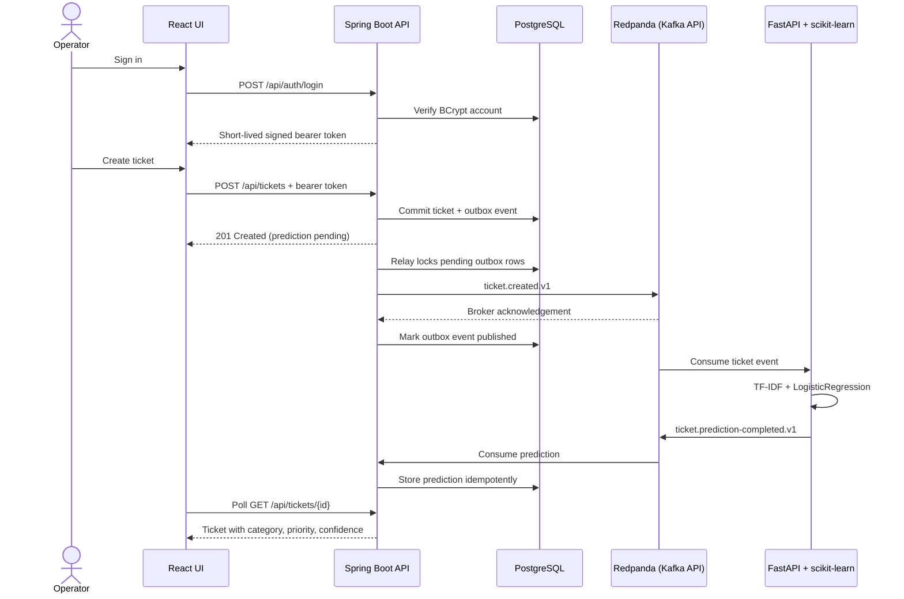

# ServiceOps Intelligence Platform

ServiceOps Intelligence is an operator-facing support platform that stores incoming
tickets immediately and classifies them asynchronously. The core vertical slice connects
React, Spring Boot, PostgreSQL, Kafka, FastAPI, and a real scikit-learn model in one
locally reproducible system. Persisted BCrypt accounts and short-lived signed tokens protect
the operator workflow with read-only and mutating roles. Immutable lifecycle history, tested
dbt marts, and a Power BI semantic model provide reproducible service-performance analytics.
A citation-enforced knowledge assistant retrieves operational guidance from versioned local
runbooks and abstains when those sources do not support an answer.
An opt-in OpenTelemetry pipeline correlates metrics, logs, and distributed traces across
HTTP, PostgreSQL, and Kafka, with provisioned SLO dashboards and tested alert delivery.
A hardened Kustomize deployment runs the same platform on Kubernetes with restricted pods,
persistent state, network isolation, autoscaling controls, and an isolated kind acceptance
test. That acceptance path also drives the rendered application in a real browser and checks
a short, thresholded HTTP load profile. CodeQL and Trivy provide scheduled and change-driven
source, dependency, secret, infrastructure, and container security gates.

> Project status: **Baseline complete - active development**

The machine-learning model is an educational baseline trained on a reproducible bundled
1,000-row synthetic corpus generated from 40 reviewed scenario families. Validation holds
out complete scenario families, and its measured scores are available from `/model-info`;
they must not be interpreted as production accuracy. The [dataset card](ai-service/data/README.md)
documents provenance, label balance, regeneration, validation boundaries, and prohibited use.


_Real local Compose runtime after ticket creation, asynchronous classification, and a
status update through the rendered React interface._

## Core event flow



The event row is a durable outbox entry committed in the same PostgreSQL transaction as
the ticket. A scheduled relay locks due rows with `FOR UPDATE SKIP LOCKED`, waits for Kafka
acknowledgement, and only then records publication. Failed attempts remain durable and are
retried with bounded exponential backoff.

Every ticket creation and real status transition is also retained in PostgreSQL. An opt-in,
deterministic 100,000-event fixture feeds dbt models for SLA compliance, backlog age, first
response time, MTTR, reopen rate, and category trends. Normal application startup never
loads this analytical fixture.

## Grounded knowledge assistant

The operator and viewer workspaces include an authenticated knowledge assistant for access,
billing, delivery, API, performance, and incident procedures. FastAPI loads six
source-controlled Markdown runbooks, splits them into 18 heading-aware chunks, and builds a
reproducible TF-IDF index at startup. Retrieval combines content and title relevance with a
lexical-support gate. A deterministic extractive generator selects only sentences from the
retrieved chunks and adds a numbered citation to every answer item.

Each runbook must define one non-empty `id`, `title`, and `revision` metadata field. Missing,
empty, or duplicate metadata causes startup to fail instead of creating ambiguous citations.

Unsupported questions return an explicit human-review response with no citations; the
assistant does not use general model knowledge to fill gaps. The fixed evaluation set covers
12 answerable questions and 4 unrelated questions. This is a deliberately small, local RAG
baseline: it has no external LLM dependency, vector database, web search, conversation memory,
or automatic document ingestion.

## Technology choices

| Component | Role |
| --- | --- |
| React 19, TypeScript, Vite | Responsive operator queue, ticket form, details, and status changes |
| Spring Boot Security, BCrypt, JWT | Persisted local identity and `VIEWER`/`OPERATOR` role enforcement |
| Spring Boot 3, Java 21 | Validated business API and event orchestration |
| Spring Data JPA, Hibernate, Flyway | Domain persistence and versioned schema migration |
| PostgreSQL 17 | Durable ticket, transactional outbox, and consumer-idempotency data |
| Redpanda | Pinned local Kafka-protocol broker with three versioned topics |
| FastAPI, scikit-learn, pandas | HTTP model inspection plus asynchronous ticket inference |
| TF-IDF retrieval, versioned Markdown runbooks | Deterministic grounded answers with per-claim citations and abstention |
| dbt Core, dbt-postgres | Tested PostgreSQL lifecycle, SLA-performance, calendar, and daily trend marts |
| Power BI TMDL | Source-controlled semantic model and operational DAX measures |
| Docker Compose | Health-gated local topology for all five services |
| Azure Container Apps, PostgreSQL, Event Hubs, ACR | Terraform-managed cloud runtime with private data and public frontend ingress |
| GitHub Actions | Independent Java, Python, frontend, Terraform, container image, and manual Azure deployment jobs |
| OpenTelemetry Java/Python + Collector | Portable OTLP instrumentation, W3C context propagation, and trace-derived RED metrics |
| Prometheus, Alertmanager, Grafana, Loki, Tempo | SLO records, error budgets, alert routing, dashboards, logs, and traces |
| Kubernetes 1.36, Kustomize, kind | Restricted workload manifests, persistent state, scaling policy, and real-cluster verification |
| Playwright, k6 | Real-browser role/workflow acceptance and a bounded Kubernetes latency baseline |
| CodeQL, Trivy | Static analysis, dependency/secret/configuration/image scanning, and container SBOMs |

## Run locally

Requirements: Docker with Compose v2 and at least 4 GB of available memory.

```bash
cp .env.example .env
docker compose up --build
```

Safe development defaults are already present in `compose.yaml`; `.env` is optional and
ignored by Git. Open:

- Operator UI: <http://localhost:3000>
- Spring OpenAPI: <http://localhost:8080/swagger-ui.html>
- Spring health: <http://localhost:8080/actuator/health>
- FastAPI OpenAPI: <http://localhost:8000/docs>
- Model metadata: <http://localhost:8000/model-info>
- Knowledge API: <http://localhost:8000/docs> (`POST /knowledge/ask`)

Sign in to the UI with one of the known local-development accounts:

- `operator` / `operator_dev_2026` - read, create, and update tickets.
- `viewer` / `viewer_dev_2026` - read-only ticket and model access.

These are deliberately non-secret local defaults. Override both passwords and the shared
JWT signing key through `.env` before using the stack outside an isolated development
machine. Existing bootstrap accounts are never overwritten on restart.

Stop containers without deleting the PostgreSQL volume:

```bash
docker compose down
```

Delete all local application data only when explicitly desired:

```bash
docker compose down --volumes
```

## Observe locally

Observability is opt-in so normal application startup stays lightweight:

```bash
docker compose \
  -f compose.yaml \
  -f compose.observability.yaml \
  up --build --detach --wait
python scripts/smoke_test.py
python scripts/observability_smoke_test.py
```

Open the provisioned dashboard at <http://localhost:3001/d/serviceops-overview> with
`admin` / `serviceops_observe_2026`. Prometheus scrapes bounded application SLI metrics while
Spring and FastAPI export OTLP logs and traces; the Collector also derives RED metrics from
spans. W3C trace context crosses HTTP and Kafka (with a producer-to-consumer span link),
traces link to logs, rolling 30-day availability and latency objectives are recorded, and
checked alerts route through Alertmanager. The deterministic drill additionally proves
firing and resolved notifications. See the [observability guide](observability/README.md) and
[response runbook](docs/observability-runbook.md).

## Deploy to Azure

The manual `Azure deployment` GitHub Actions workflow provisions a controlled-cost demo
topology with Terraform. It builds immutable images in ACR, deploys the frontend, backend,
and AI worker to a VNet-integrated Container Apps environment, uses private PostgreSQL
Flexible Server storage, and replaces local Redpanda with three Event Hubs exposed through
the Kafka-compatible TLS endpoint. Only the frontend has public ingress.

The workflow uses GitHub-to-Azure OIDC, encrypted remote state, generated application
credentials, and a pull-only managed identity for ACR. A normal push never provisions or
changes cloud resources. See the [Azure deployment guide](infra/azure/README.md) for the
required repository secrets, variables, permissions, deploy sequence, credential handling,
and explicit destroy procedure.

This repository contains and validates the deployment capability; it does not claim an
always-on public environment. Running the workflow creates billable Azure resources until
the matching destroy action completes.

## Deploy to Kubernetes

The base Kustomize resources deploy the frontend, backend, AI service, PostgreSQL, and
Redpanda with non-root containers, Restricted Pod Security, health probes, resource bounds,
least-privilege service accounts, NetworkPolicies, persistent claims, topology spreading,
and disruption budgets. The production overlay adds replicated stateless services,
`autoscaling/v2` policies, external Secrets, private-registry pulls, and a LoadBalancer
frontend. Cluster-level choices such as TLS, DNS, storage, CNI, and metrics-server remain
explicit prerequisites.

Run the complete disposable kind acceptance test:

```bash
python scripts/validate_kubernetes.py
cd frontend && npm ci && npx playwright install chromium firefox webkit && cd ..
python scripts/kubernetes_smoke_test.py --quality-gates
```

The quality-gate mode runs the three browser journeys on Chromium, Firefox, and WebKit, then a
30-second, one-iteration-per-second k6 profile through the same forwarded Nginx boundary before
exercising PostgreSQL and Redpanda recovery. k6 uses its pinned container when no local binary
is installed. See the [Kubernetes deployment guide](k8s/README.md) for the measured thresholds
and evidence paths.

The manual `Kubernetes deployment` workflow builds immutable GHCR images, server-validates
the rendered resources, applies them to an environment namespace, waits for readiness, and
runs the same-origin smoke test. Its confirmed destroy mode removes only that namespace.
See the [Kubernetes deployment guide](k8s/README.md) for tools, GitHub Environment secrets,
direct deployment, observability integration, recovery behavior, and production boundaries.

## Build analytics locally

Analytics is opt-in and runs against the PostgreSQL schema migrated by the backend:

```bash
docker compose up --build --detach --wait
docker compose --profile analytics build analytics
docker compose --profile analytics run --rm analytics serviceops-generate-analytics
docker compose --profile analytics run --rm analytics
```

The generator produces exactly 100,000 deterministic, non-sensitive lifecycle events by
default. The final analytics command executes `dbt build`, including every model and data
test. See the [analytics guide](analytics/README.md) for metric definitions, idempotency,
environment overrides, migrated-history semantics, and Power BI model usage.

## Demonstration

1. Open the UI and sign in as the local operator.
2. Create a ticket with a meaningful title and description.
3. The row appears immediately with an `Analyzing…` state.
4. Spring stores the ticket and outbox event atomically; the relay publishes
   `serviceops.ticket.created.v1` and records the broker acknowledgement.
5. The AI worker validates the event and emits `serviceops.ticket.prediction-completed.v1`.
6. Spring validates and persists the idempotent prediction.
7. The UI poll updates the row and detail panel with category, priority, and confidence.
8. Change the status from the detail panel to verify the command path.
9. Ask the knowledge assistant how to triage repeated API errors and inspect its citations.

The standard-library smoke test automates the same public API flow:

```bash
python scripts/smoke_test.py
```

## Run tests

Backend (Java 21 and Maven 3.9+):

```bash
cd backend
mvn --batch-mode --no-transfer-progress verify
```

The PostgreSQL repository integration test uses Testcontainers and requires a working
Docker engine.

AI service (Python 3.12+):

```bash
cd ai-service
python -m venv .venv
.venv/Scripts/python -m pip install -e ".[dev]"  # Windows
.venv/Scripts/python -m serviceops_ai.dataset
.venv/Scripts/python -m ruff check src tests ../scripts/cloud_smoke_test.py
.venv/Scripts/python -m pytest
```

On Linux or macOS, replace `.venv/Scripts/python` with `.venv/bin/python`.

Frontend (Node.js 22+):

```bash
cd frontend
npm ci
npm run lint
npm test
npm run build
```

Azure infrastructure (Terraform 1.15.8):

```bash
terraform -chdir=infra/azure fmt -check -recursive
terraform -chdir=infra/azure init -backend=false
terraform -chdir=infra/azure validate
terraform -chdir=infra/azure test
```

Analytics (Python 3.12+, PostgreSQL 17):

```bash
cd analytics
python -m pip install -e ".[dev]"
python -m ruff check src tests scripts
python -m pytest
python scripts/validate_power_bi_model.py
dbt build --project-dir dbt --profiles-dir dbt
```

Kubernetes manifests (kubectl 1.34+, checked against Kubernetes 1.36):

```bash
python scripts/validate_kubernetes.py
kubectl kustomize k8s/overlays/local
kubectl kustomize k8s/overlays/production
```

## Public API

- `POST /api/auth/login` (public credential exchange)
- `GET /api/auth/me` (authenticated identity)
- `POST /api/tickets`
- `GET /api/tickets`
- `GET /api/tickets/{id}`
- `PATCH /api/tickets/{id}/status`
- `GET /api/summary`
- `GET /actuator/health`
- `GET /actuator/prometheus`
- `POST /predict`
- `GET /health`
- `GET /model-info`
- `GET /metrics`
- `POST /knowledge/ask` (direct AI-service route)
- `POST /assistant/ask` (same-origin frontend proxy used by the UI)

Health and OpenAPI endpoints remain public for container orchestration and API discovery.
All business endpoints require a signed bearer token. `VIEWER` can read tickets, summary,
model metadata, and cited knowledge answers; `OPERATOR` additionally creates tickets,
changes status, and calls the direct model prediction endpoint.

JSON Schema contracts live in [`contracts`](contracts). Invalid consumer messages are
sent to `serviceops.ticket.invalid.v1`, and consumers use bounded retries or explicit
invalid-message handling.

## Technical documentation

- [Architecture and reliability behavior](docs/architecture.md)
- [API requests, responses, and error examples](docs/api-examples.md)
- [Test strategy and acceptance procedure](docs/test-strategy.md)
- [Phased roadmap](docs/roadmap.md)
- [Azure deployment and teardown](infra/azure/README.md)
- [Analytics pipeline, metrics, and Power BI model](analytics/README.md)
- [Observability stack, objectives, and validation](observability/README.md)
- [Observability response runbook](docs/observability-runbook.md)
- [Kubernetes deployment, verification, and operations](k8s/README.md)

## Verified baseline

Local baseline evidence includes the full-stack regression from 9 August 2026 and later
component checks where noted:

- Java: 34 tests passed, including Spring Security role enforcement, PostgreSQL 17,
  Flyway V1-V4, lifecycle history, JPA, JSONB, outbox retry state, and concurrent row
  locking through Testcontainers.
- Python (rechecked 19 August 2026): Ruff passed and 28 pytest tests passed, including
  deterministic corpus regeneration, scenario-grouped validation, dataset-aware model caching,
  shared JWT validation, RAG retrieval/abstention evaluation, and Event Hubs Kafka validation.
- Frontend: ESLint passed, 19 Vitest tests passed, TypeScript compiled, and the Vite
  production bundle completed.
- Analytics: Ruff passed and 4 pytest tests passed; the fixed fixture generated 40,000
  tickets and exactly 100,000 lifecycle events; dbt built 6 models and passed all 52 data
  tests on PostgreSQL 17; the 59-pass build had zero warnings or errors; the Power BI TMDL
  contract contained all 6 required measures. Repeating the fixture inserted zero rows and
  reproduced SHA-256 `f2d50639d79b9ac3d0b20a1a246f40c67cb0060fa320f6ba3cf12a861f2fd464`.
- Compose: configuration validation passed; all four images built; PostgreSQL, Redpanda,
  Spring Boot, FastAPI, and React/Nginx reported healthy; the opt-in analytics image loaded
  the full fixture and completed its own green `dbt build`.
- Observability: all 12 long-running services reported healthy and the non-root data-volume
  initializer exited successfully; all seven Prometheus scrape targets were up, 17 checked
  recording/alerting rules loaded, and the fixed rule tests passed. The runtime smoke test
  proved both applications' SLI and trace-derived metrics, OTLP logs and traces, the Kafka
  producer-to-consumer span link, provisioned Grafana assets, firing webhook delivery,
  recovery, and resolved delivery.
- End to end: the authenticated smoke test passed from a clean application volume, including
  a cited RAG answer and unrelated-question abstention through Nginx; its runtime ticket
  retained ordered `CREATED` and `STATUS_CHANGED` lifecycle rows.
- Authentication: anonymous access returned `401`; the viewer could read but received
  `403` for Spring and FastAPI mutations; the operator token worked across both services;
  bootstrap passwords were stored as BCrypt hashes.
- Runtime reliability: both event topics were inspected, prediction replay was idempotent,
  malformed input reached the structured invalid-event topic, PostgreSQL/backend restarts
  preserved a ticket, the persisted model hash survived an AI-service restart, and an
  outbox event created during a Kafka outage was delivered after both broker recovery and
  a backend process restart.
- Browser: the grounded answer and two source cards rendered through the real application;
  ticket creation, prediction polling, accessible detail display, and status update remained
  available with no browser console warnings or errors.
- Azure deployment: Terraform 1.15.8 formatting and AzureRM 4.81.0 schema validation
  passed; the credential-free mocked plan test verified the network/ingress/identity
  boundaries; actionlint passed for all three workflows; and the cloud-style smoke script passed
  through the public Nginx boundary. No paid Azure resources were created in this local run.
- Kubernetes: both overlays passed source, Kustomize, strict Kubernetes 1.36 schema, and
  server-side validation; a disposable kind 1.36.1 cluster brought all five workloads Ready,
  denied backend Secret reads, completed two event round trips, retained a classified ticket
  across PostgreSQL pod replacement, recovered after Redpanda pod replacement, completed
  the three Playwright role/workflow journeys, and passed the bounded k6 thresholds.
- Security: CodeQL covers Java/Kotlin, JavaScript/TypeScript, Python, and GitHub Actions;
  Trivy gates fixed high/critical source dependencies, tracked-tree secrets, high/critical
  Docker/Terraform/Kubernetes misconfigurations, and fixed critical container findings while
  publishing CycloneDX SBOMs for all six runtime images.
- Model (rechecked 19 August 2026): 1,000 unique synthetic training rows generated from 40
  reviewed scenario families; the grouped holdout measured `0.4967` category accuracy and
  `0.5133` priority accuracy. Whole scenario families are isolated between training and
  validation, making this a stricter regression measure than the previous random-row split.

## Current limitations

- The expanded model corpus is synthetic and intended for deterministic regression. Production
  training still requires approved representative labels, privacy review, bias analysis,
  temporal validation, and drift monitoring; local grouped-holdout scores are not production
  performance claims.
- The checked Kubernetes runtime is self-contained but its PostgreSQL and Redpanda
  StatefulSets are single replicas. Production use requires an approved replicated data
  design, backups, tested restoration, TLS/DNS, and cluster-specific capacity planning; a
  successful local kind run is not a multi-node availability or load-test claim.
- The checked observability topology is single-node and validated locally, not a claim of a
  highly available or capacity-tested telemetry control plane. Production use requires an
  approved external alert receiver, protected access, replicated durable storage, and an
  environment-specific retention/capacity plan.
- The bundled knowledge base is intentionally small and manually curated. The RAG baseline
  uses deterministic extractive generation rather than a general-purpose LLM; automatic
  ingestion, conversation memory, human approval, and broader prompt-safety evaluation remain
  roadmap work.
- The Power BI semantic model and measures are source controlled, but cross-platform CI does
  not claim a Desktop/Fabric refresh or a published dashboard. Operational SLA enforcement,
  escalation, and ownership workflows remain separate roadmap work.
- Azure deployment is implemented as validated Terraform and a manual deploy/destroy
  workflow, but no always-on hosted environment or production availability claim is made.
  Event Hubs and ACR use authenticated public endpoints, while PostgreSQL is private.
- Authentication uses local bootstrap accounts and short-lived access tokens. External
  identity federation, self-service account lifecycle, refresh/revocation flows, and a
  managed secret store remain roadmap work. Local Compose still uses development HTTP;
  Azure application ingress and managed service connections use TLS.
- Browser automation, load measurements, and security scanning are checked baselines, not
  exhaustive assurance. The browser suite covers Chromium, Firefox, and WebKit on one runner,
  but not an operating-system, device, or browser-version matrix. The load profile is deliberately
  short and low-rate, and automated scanners do not replace threat modeling, penetration testing,
  stress/soak testing, or production capacity validation.
