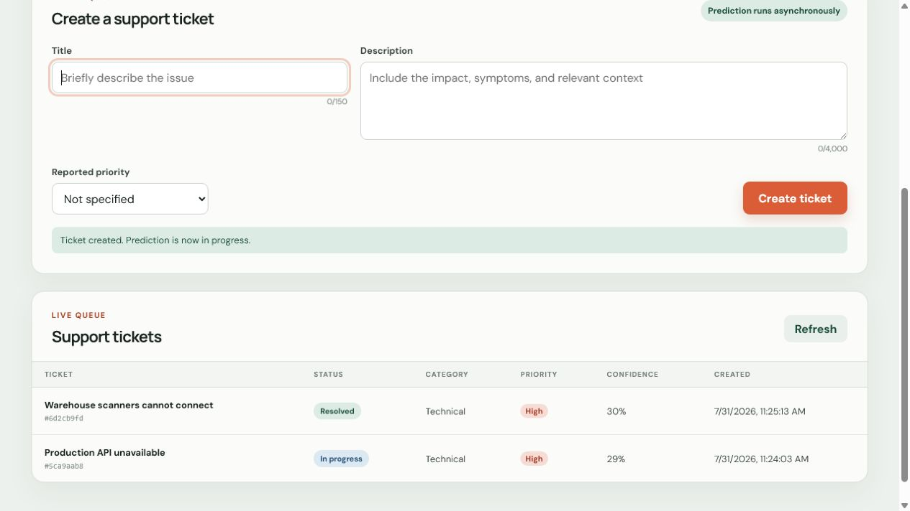
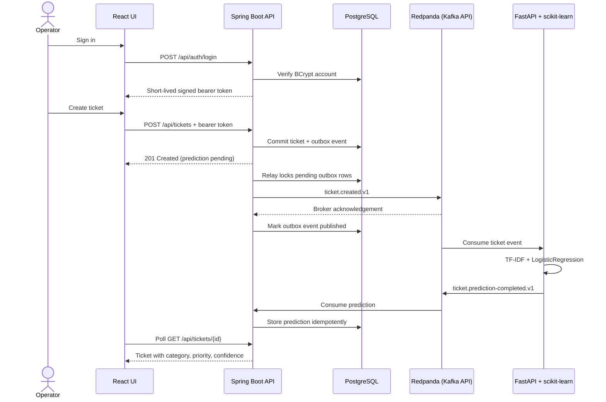

# ServiceOps Intelligence Platform

ServiceOps Intelligence is an operator-facing support platform that stores incoming
tickets immediately and classifies them asynchronously. The core vertical slice connects
React, Spring Boot, PostgreSQL, Kafka, FastAPI, and a real scikit-learn model in one
locally reproducible system. Persisted BCrypt accounts and short-lived signed tokens protect
the operator workflow with read-only and mutating roles.

> Project status: **Baseline complete - active development**

The machine-learning model is an educational baseline trained on a small bundled
synthetic dataset. Its measured validation scores are available from `/model-info`; they
must not be interpreted as production accuracy.



_Real local Compose runtime after ticket creation, asynchronous classification, and a
status update through the rendered React interface._

## Core event flow



The event row is a durable outbox entry committed in the same PostgreSQL transaction as
the ticket. A scheduled relay locks due rows with `FOR UPDATE SKIP LOCKED`, waits for Kafka
acknowledgement, and only then records publication. Failed attempts remain durable and are
retried with bounded exponential backoff.

## Technology choices

| Component | Role |
| --- | --- |
| React 19, TypeScript, Vite | Responsive operator queue, ticket form, details, and status changes |
| Spring Boot Security, BCrypt, JWT | Persisted local identity and `VIEWER`/`OPERATOR` role enforcement |
| Spring Boot 3, Java 21 | Validated business API and event orchestration |
| Spring Data JPA, Hibernate, Flyway | Domain persistence and versioned schema migration |
| PostgreSQL 17 | Durable ticket, transactional outbox, and consumer-idempotency data |
| Redpanda | Pinned local Kafka-protocol broker with three versioned topics |
| FastAPI, scikit-learn, pandas | HTTP model inspection plus asynchronous ticket inference |
| Docker Compose | Health-gated local topology for all five services |
| GitHub Actions | Independent Java, Python, frontend, and container image quality jobs |

## Run locally

Requirements: Docker with Compose v2 and at least 4 GB of available memory.

```bash
cp .env.example .env
docker compose up --build
```

Safe development defaults are already present in `compose.yaml`; `.env` is optional and
ignored by Git. Open:

- Operator UI: <http://localhost:3000>
- Spring OpenAPI: <http://localhost:8080/swagger-ui.html>
- Spring health: <http://localhost:8080/actuator/health>
- FastAPI OpenAPI: <http://localhost:8000/docs>
- Model metadata: <http://localhost:8000/model-info>

Sign in to the UI with one of the known local-development accounts:

- `operator` / `operator_dev_2026` - read, create, and update tickets.
- `viewer` / `viewer_dev_2026` - read-only ticket and model access.

These are deliberately non-secret local defaults. Override both passwords and the shared
JWT signing key through `.env` before using the stack outside an isolated development
machine. Existing bootstrap accounts are never overwritten on restart.

Stop containers without deleting the PostgreSQL volume:

```bash
docker compose down
```

Delete all local application data only when explicitly desired:

```bash
docker compose down --volumes
```

## Demonstration

1. Open the UI and sign in as the local operator.
2. Create a ticket with a meaningful title and description.
3. The row appears immediately with an `Analyzing…` state.
4. Spring stores the ticket and outbox event atomically; the relay publishes
   `serviceops.ticket.created.v1` and records the broker acknowledgement.
5. The AI worker validates the event and emits `serviceops.ticket.prediction-completed.v1`.
6. Spring validates and persists the idempotent prediction.
7. The UI poll updates the row and detail panel with category, priority, and confidence.
8. Change the status from the detail panel to verify the command path.

The standard-library smoke test automates the same public API flow:

```bash
python scripts/smoke_test.py
```

## Run tests

Backend (Java 21 and Maven 3.9+):

```bash
cd backend
mvn --batch-mode --no-transfer-progress verify
```

The PostgreSQL repository integration test uses Testcontainers and requires a working
Docker engine.

AI service (Python 3.12+):

```bash
cd ai-service
python -m venv .venv
.venv/Scripts/python -m pip install -e ".[dev]"  # Windows
.venv/Scripts/python -m ruff check src tests
.venv/Scripts/python -m pytest
```

On Linux or macOS, replace `.venv/Scripts/python` with `.venv/bin/python`.

Frontend (Node.js 22+):

```bash
cd frontend
npm ci
npm run lint
npm test
npm run build
```

## Public API

- `POST /api/auth/login` (public credential exchange)
- `GET /api/auth/me` (authenticated identity)
- `POST /api/tickets`
- `GET /api/tickets`
- `GET /api/tickets/{id}`
- `PATCH /api/tickets/{id}/status`
- `GET /api/summary`
- `GET /actuator/health`
- `POST /predict`
- `GET /health`
- `GET /model-info`

Health and OpenAPI endpoints remain public for container orchestration and API discovery.
All business endpoints require a signed bearer token. `VIEWER` can read tickets, summary,
and model metadata; `OPERATOR` additionally creates tickets, changes status, and calls the
direct model prediction endpoint.

JSON Schema contracts live in [`contracts`](contracts). Invalid consumer messages are
sent to `serviceops.ticket.invalid.v1`, and consumers use bounded retries or explicit
invalid-message handling.

## Technical documentation

- [Architecture and reliability behavior](docs/architecture.md)
- [API requests, responses, and error examples](docs/api-examples.md)
- [Test strategy and acceptance procedure](docs/test-strategy.md)
- [Phased roadmap](docs/roadmap.md)

## Verified baseline

The latest local regression on 1 August 2026 measured:

- Java: 27 tests passed, including Spring Security role enforcement, PostgreSQL 17,
  Flyway V1-V3, JPA, JSONB, outbox retry state, and concurrent row locking through
  Testcontainers.
- Python: Ruff passed and 13 pytest tests passed, including shared JWT validation.
- Frontend: ESLint passed, 17 Vitest tests passed, TypeScript compiled, and the Vite
  production bundle completed.
- Compose: configuration validation passed; all three images built; PostgreSQL, Redpanda,
  Spring Boot, FastAPI, and React/Nginx reported healthy.
- End to end: the smoke test passed twice after separate clean-volume starts.
- Authentication: anonymous access returned `401`; the viewer could read but received
  `403` for Spring and FastAPI mutations; the operator token worked across both services;
  bootstrap passwords were stored as BCrypt hashes.
- Runtime reliability: both event topics were inspected, prediction replay was idempotent,
  malformed input reached the structured invalid-event topic, PostgreSQL/backend restarts
  preserved a ticket, the persisted model hash survived an AI-service restart, and an
  outbox event created during a Kafka outage was delivered after both broker recovery and
  a backend process restart.
- Browser: ticket creation, prediction polling, accessible detail display, and status
  update passed through the real rendered application with no browser console errors.
- Model: 40 synthetic training rows; the fixed held-out split measured `0.60` category
  accuracy and `0.50` priority accuracy. These small-sample scores are reproducibility
  evidence, not production performance claims.

## Current limitations

- The synthetic model dataset is deliberately small and non-production.
- Cloud deployment, analytics, RAG, observability, and Kubernetes are roadmap work and are
  not represented as complete.
- Authentication uses local bootstrap accounts and short-lived access tokens. External
  identity federation, self-service account lifecycle, refresh/revocation flows, TLS, and
  managed secret storage remain deployment work.
- Browser-engine automation, load measurements, and security scanning are for next phase work;
  the current cross-service smoke test uses authenticated HTTP APIs.
