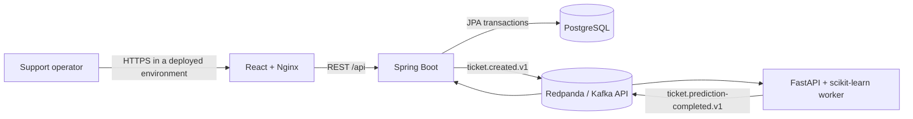
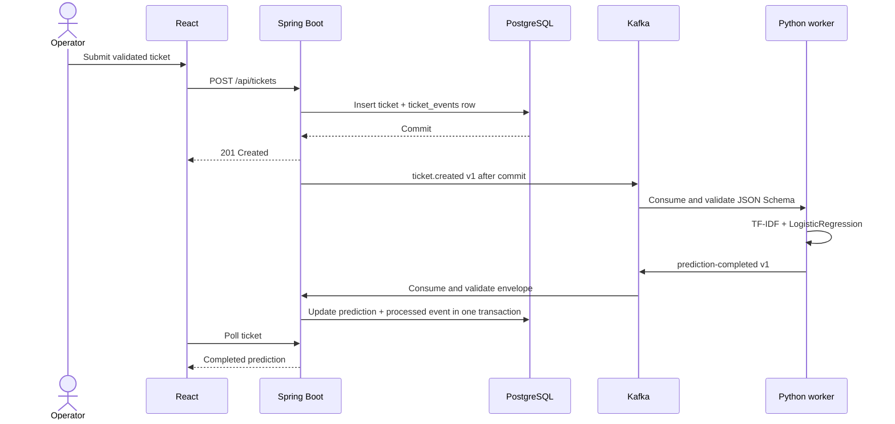

# Architecture

ServiceOps Intelligence is a compact event-driven support workflow. Spring Boot owns
the public business API and PostgreSQL data. The Python service owns the educational
machine-learning model. Kafka decouples ticket intake from prediction so operators do
not wait for inference before a ticket is stored.

## Runtime topology

| Service | Responsibility | Health signal |
| --- | --- | --- |
| `frontend` | Operator queue, ticket creation, details, status changes, polling | Nginx `/health` |
| `backend` | Validation, REST API, persistence, event production and prediction consumption | Actuator verifies application, PostgreSQL, and Kafka |
| `ai-service` | Model loading, synchronous `/predict`, Kafka inference worker | `/health` requires a model and a broker-connected worker |
| `postgres` | Tickets, transactional event records, processed-event keys | `pg_isready` |
| `kafka` | Three versioned event topics | Redpanda cluster health |

## Ticket creation sequence

## Consistency and failure behavior

- Ticket and `ticket_events` rows are persisted in one database transaction.
- Ticket-created publication happens after commit. A crash between commit and publication
  can leave an unpublished row; a durable outbox relay is the next reliability step.
- Both producers request idempotent Kafka delivery and wait for delivery confirmation.
- Python derives a deterministic prediction event ID from the input event ID. Replaying an
  input therefore produces the same downstream idempotency key.
- Spring stores prediction event IDs in `processed_events` in the same transaction as the
  ticket update. Replayed prediction events are ignored.
- Consumer processing is bounded. Invalid or exhausted events are published as structured
  records to `serviceops.ticket.invalid.v1` with failure and source context.
- Event topics and envelopes are versioned. JSON Schemas in `contracts/` reject unknown
  fields and constrain identifiers, timestamps, labels, and confidence.

## Data ownership

Spring Boot is the only writer to application tables. The AI service does not connect to
PostgreSQL. The model artifact is stored in the Compose `ai-model` volume and retrained
only when a compatible `baseline-1` artifact is absent.

## Security boundary

This local baseline intentionally has no authentication or authorization. Development
credentials in Compose are non-secret defaults, and `.env` is ignored. Before deployment,
add identity, authorization, secret management, TLS, origin restrictions, dependency
scanning, and an externalized broker/database configuration.
