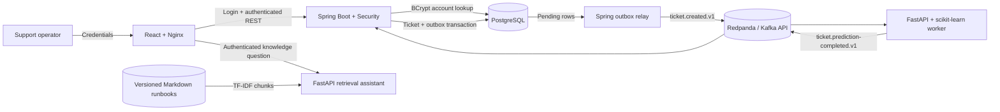
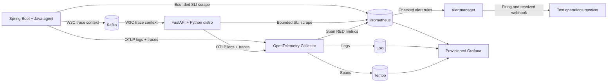
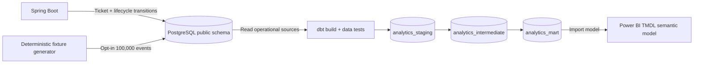
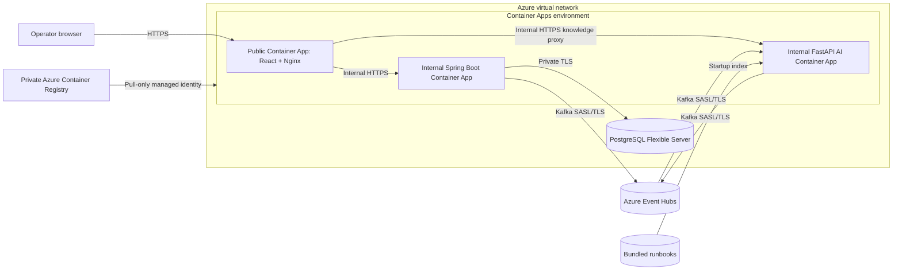
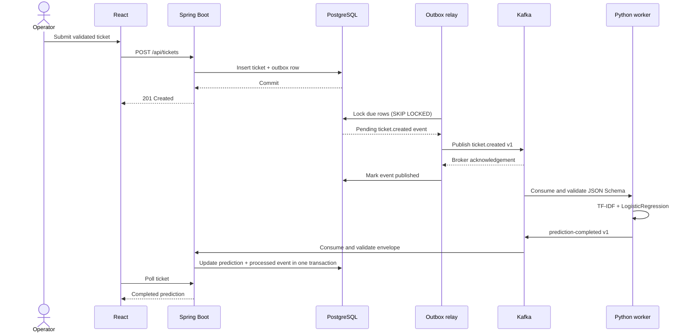

# Architecture

ServiceOps Intelligence is a compact event-driven support workflow. Spring Boot owns
the public business API and PostgreSQL data. The Python service owns the educational
machine-learning model. Kafka decouples ticket intake from prediction so operators do
not wait for inference before a ticket is stored. A read-oriented dbt layer turns immutable
ticket lifecycle history into tested PostgreSQL marts for the Power BI semantic model.

## Runtime topology

| Service | Responsibility | Health signal |
| --- | --- | --- |
| `frontend` | Sign-in, role-aware operator queue, ticket creation, details, status changes, polling | Nginx `/health` |
| `backend` | Local identity, JWT issuance/validation, role enforcement, REST API, persistence, event production and prediction consumption | Actuator verifies application, PostgreSQL, and Kafka |
| `ai-service` | Shared JWT validation, cited knowledge retrieval, model loading, synchronous `/predict`, Kafka inference worker | `/health` requires the model, knowledge index, and broker-connected worker |
| `postgres` | Tickets, transactional event records, processed-event keys | `pg_isready` |
| `kafka` | Three versioned event topics | Redpanda cluster health |

## Kubernetes runtime

Kustomize maps the three stateless applications to Deployments and the two stateful
dependencies to StatefulSets. Only the frontend Service crosses the public boundary; it
continues to proxy `/api/` to Spring and `/assistant/` to FastAPI, so backend and AI Services
remain cluster-internal. PostgreSQL and Redpanda use independent `ReadWriteOnce` claims.

The namespace enforces Restricted Pod Security. Workloads have numeric non-root identities,
no mounted Kubernetes API credentials, bounded resources, startup/readiness/liveness probes,
rolling-update controls, and default-deny ingress policy. Production Kustomize resources add
replicas and CPU HPAs for the stateless tier; their usefulness depends on a multi-node
cluster and metrics-server. The single bundled PostgreSQL and Redpanda replicas are a
portable acceptance topology, not a highly available state layer.

## Observability topology

The application images contain pinned OpenTelemetry instrumentation but keep it disabled by
default. The opt-in Compose overlay activates OTLP/HTTP export without changing application
code or the normal runtime topology:

Spring and FastAPI expose the same bounded `serviceops_http_*` metric labels: service, method,
route template, and status code. Raw URLs, ticket fields, knowledge questions, tokens, and
credentials are deliberately excluded. Collector span metrics provide an independent RED
view and exemplars. Kafka propagation is represented as a producer-to-consumer span link in
accordance with the asynchronous messaging model. Grafana provisions bidirectional trace/log
links and trace-to-metrics queries so an operator can move between symptoms and one
correlated request or message flow.

Prometheus evaluates rolling 30-day 99.5% availability and 95%-within-one-second latency
objectives, error-budget records, burn alerts, component health, and telemetry health. The
single-node local stores validate the capability and response process; they are not an HA
production control plane.

## Analytics topology

Migration V4 records creation and every status change in `ticket_lifecycle_events` within
the same transaction as the ticket command. Repeating the current status is a no-op and
does not create a misleading lifecycle record. A transition away from `RESOLVED` is tagged
`REOPENED`. Existing V1-V3 tickets receive a `MIGRATED` snapshot at their last update time;
the warehouse exposes this lower-fidelity lineage instead of fabricating prior events.

dbt reads the application-owned tables and writes only to `analytics_*` schemas. The
performance mart has one row per ticket, priority-based first-response and resolution
deadlines, exact or qualified timestamps, current backlog age, breach flags, and reopen
counts. A separate daily mart supports category and priority trends. The Power BI model
keeps connection host/database as parameters and never stores credentials.

## Azure deployment topology

The cloud deployment preserves the same service and ownership boundaries while replacing
local infrastructure with managed Azure services:

Terraform creates a workload-profile Container Apps environment on a dedicated subnet and
a separate delegated PostgreSQL subnet with private DNS. PostgreSQL has public network
access disabled. Spring and FastAPI have internal ingress, and only Nginx receives a public
HTTPS hostname. Nginx resolves both generated internal hostnames at container startup and
proxies authenticated `/assistant/` requests to the AI service.

Event Hubs remains reachable through its public Kafka endpoint but requires TLS plus a
namespace-scoped SAS credential. Its three event hubs are provisioned explicitly because
Event Hubs does not implement Kafka `AdminClient` topic management. Local Redpanda keeps
automatic topic creation enabled; the Azure backend disables only that behavior.

ACR administrator credentials are disabled. A shared user-assigned identity receives only
the `AcrPull` role and is used by Container Apps to fetch immutable images. Terraform
generates PostgreSQL, JWT, operator, and viewer secrets and stores them in encrypted Azure
Blob remote state and Container Apps secret values. Key Vault integration, external
identity, a managed telemetry backend, managed analytics execution, Power BI publishing,
and Kubernetes are outside this deployment. The application containers can export all
signals to an explicitly configured external HTTPS OTLP endpoint; telemetry stays disabled
when no endpoint is supplied. The repository analytics can run against any reachable
PostgreSQL instance but is not silently provisioned by the Azure workflow.

## Ticket creation sequence

## Consistency and failure behavior

- Ticket and `ticket_events` outbox rows are persisted in one database transaction.
- The relay locks due unpublished rows with PostgreSQL `FOR UPDATE SKIP LOCKED`, allowing
  multiple backend instances to work without publishing the same row concurrently.
- A row is marked published only after Kafka acknowledges the send. Failures retain the
  payload, attempt count, next-attempt time, and last error for bounded exponential retry.
- Delivery is at least once: a crash after Kafka acknowledgement but before the database
  update can cause a replay. Stable event IDs and downstream idempotency make that safe.
- Both producers request idempotent Kafka delivery and wait for delivery confirmation.
- Python derives a deterministic prediction event ID from the input event ID. Replaying an
  input therefore produces the same downstream idempotency key.
- Spring stores prediction event IDs in `processed_events` in the same transaction as the
  ticket update. Replayed prediction events are ignored.
- Consumer processing is bounded. Invalid or exhausted events are published as structured
  records to `serviceops.ticket.invalid.v1` with failure and source context.
- Event topics and envelopes are versioned. JSON Schemas in `contracts/` reject unknown
  fields and constrain identifiers, timestamps, labels, and confidence.

When upgrading an existing database, migration V2 leaves historical event rows pending.
The relay may replay them once; the existing deterministic and idempotent consumers absorb
those duplicates while closing any pre-upgrade publication gap.

## Data ownership

Spring Boot is the normal writer to application tables, including `app_users`. Passwords are
stored only as BCrypt hashes. The AI service does not connect to PostgreSQL. The model
artifact is stored in the Compose `ai-model` volume and retrained only when a compatible
`baseline-2` artifact with the current dataset digest is absent. The bundled model corpus is
generated deterministically from 40 reviewed scenario families. Validation holds out complete
scenario families, so contextual variants of one scenario cannot appear in both training and
validation. The explicitly invoked analytics fixture generator is the only exception to normal
application writes: it bulk-loads deterministic synthetic tickets and histories for validation.
dbt is read-only toward application tables and owns only its analytical schemas.

The AI service also owns the read-only knowledge index. Six tracked Markdown runbooks are
parsed into 18 heading-aware chunks at startup; their content and metadata produce a stable
index version digest. Query-time ranking combines word and phrase TF-IDF similarity, title
similarity, and lexical overlap. Before retrieval, a deterministic guard normalizes the question
through Unicode, URL, and HTML canonicalization; inspects printable Base64 segments; collapses
common separator obfuscation; and rejects English, Polish, and Ukrainian instruction-override,
role-injection, jailbreak, citation-bypass, and protected-context exfiltration patterns. Rejected
questions receive no source content or citations. The extractive answer stage can use only
retrieved source sentences, labels each item with a citation number, and abstains when no passage
crosses the support gate. Runbook metadata, headings, and content pass through the same guard
before chunk creation; a detected directive fails AI-service startup before the document enters
the index. No user question or generated response is persisted.

## Security boundary

The React client exchanges a username and password only with Spring Boot. Spring Security
verifies a persisted BCrypt hash and returns a 15-minute HS256 JWT containing the subject,
issuer, audience, expiry, and role. The token lives in browser `sessionStorage`, is attached
to API requests, and is cleared on sign-out, expiry, or a `401` response. Spring and FastAPI
independently verify the same signature and claims.

Role policy is deliberately small:

| Capability | `VIEWER` | `OPERATOR` |
| --- | --- | --- |
| Read tickets and summary | Yes | Yes |
| Read model metadata | Yes | Yes |
| Ask cited knowledge questions | Yes | Yes |
| Create tickets and change status | No | Yes |
| Call direct `/predict` diagnostic | No | Yes |

Health checks, OpenAPI documents, and Prometheus scrape endpoints are public at the
application layer; the Compose observability overlay binds its control-plane ports only to
localhost. Kafka consumers remain internal service
workloads and do not accept end-user credentials. Compose includes known non-secret local
accounts and a development signing key so a clean clone is reproducible; every value is
environment-configurable. The Azure deployment provides TLS ingress and managed
broker/database endpoints, but a production environment still requires external identity
or controlled account provisioning, Key Vault-backed secret rotation, token
refresh/revocation policy, stricter network egress and origin policy, dependency scanning,
and operational monitoring.
